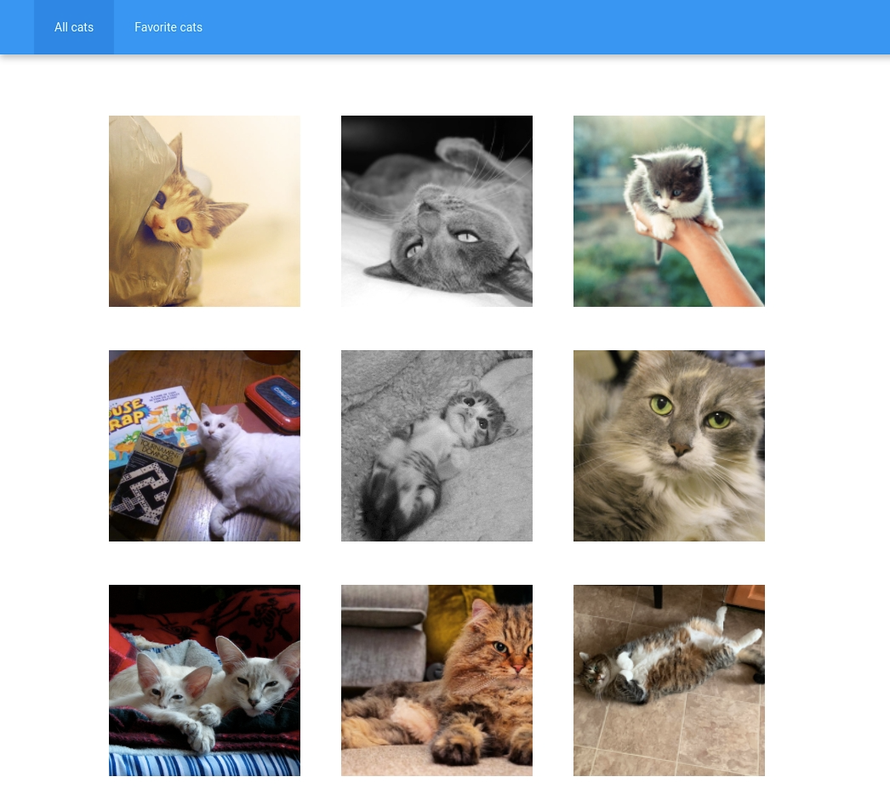
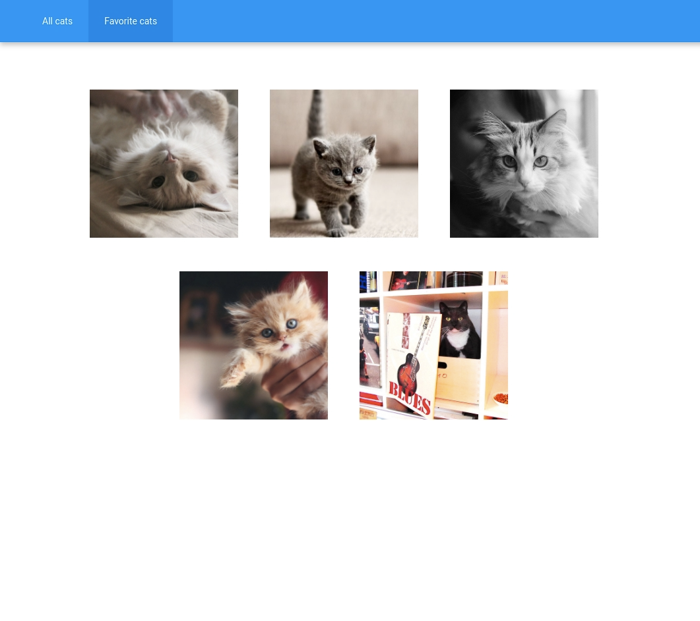

# Pintercats
[](https://codeclimate.com/github/tinawebdev/pintercats/maintainability)

**Cats Viewer app using TheCatApi**

* Fething the data in JSON format from the [TheCatApi](https://docs.thecatapi.com/).
* Dynamically inserting the images into the DOM on initial loading.
* When the user scrolls close to the bottom of the page the app makes another GET request to the API and inserts images into the DOM (lazy loading).
* The app stores liked images in LocalStorage.
* Module bundler: [Webpack 5](https://webpack.js.org/)
* Linter: [ESLint](https://eslint.org/) ([eslint-config-google](https://github.com/google/eslint-config-google))

## Demo
You can view a live version [here](https://tinawebdev.github.io/pintercats/).

<div style="display: flex; align-items: flex-start;">
  <table><tr><td>
    
    
  </td></tr></table>
</div>

## System requirements
* [Node.js](https://nodejs.org/en/)
* [Git](https://github.com/git-guides/install-git)

## Installation
To install, run the following commands into a Terminal window:
```
git clone git@github.com:tinawebdev/pintercats.git
cd pintercats
npm install
npm run build-dev
```

## Resources
* Fonts: [Google Fonts](https://fonts.google.com/)
* Images: [TheCatApi](https://docs.thecatapi.com/)
